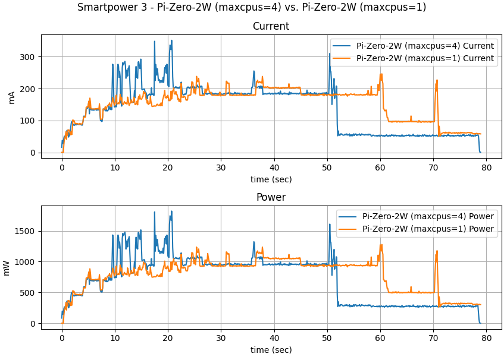
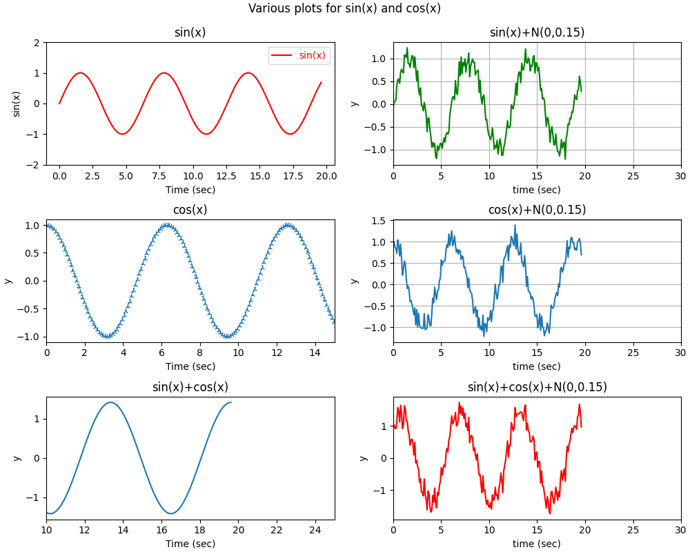
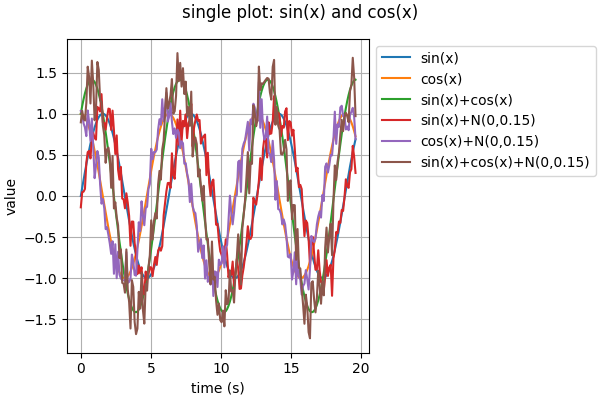

Realtime Python Datamonitor
===========================

Introduction
------------

This project implements a (realtime) data-plotter for sensor-data. Under the
hood, it uses Matplotlib, but instead of programming the plot yourself, you
just need to describe the data/plot using a configuration file.

Basic assumption is that you either have the data already in CSV-format
in a file, or you can read the data from a device (e.g. serial-line). One
column should have timestamp data (usually in ms), the other columns
represent the sensor-data.

Installation
------------

Use the following commands to install the data-monitor:

    git clone https://github.com/bablokb/py-datamon.git
    cd py-datamon
    sudo tools/install

If your system is not Debian-based, you should edit the install
commands within `tools/install` to your needs.

This will copy the python-script `py-datamon.py` and some support classes
to your system and will create a python-virtualenv with prerequisite
packages. It also copies the shell-script `py-datamon`, which will
start the python-script from within the virtualenv.

In addition, you might have to install a suitable GUI-backend (TkInter, Qt5)
with python-bindings for Matplotlib. You usually do this using the
package-manager of your distribution (on PiOS this was already
preinstalled).

Test and simple use
-------------------

To test the program, run these commands:

    # create test-data (takes 20 seconds)
    tools/sincos-data.py 0.1 200 | tee testdata.csv

    # create plot with 3x2 subplots, one value each
    /usr/local/bin/py-datamon -c sincos3x2x1.json testdata.csv

    # or all values in a single subplot
    /usr/local/bin/py-datamon -c sincos1x1x6.json testdata.csv

To test the live-monitoring, use

    tools/sincos-data.py 0.1 | \
       /usr/local/bin/py-datamon -c sincos6x1.json -

Read the [full documentation](doc/usage.md) for all the details.

Configuration
-------------

If you wonder where those json-files are: these sample files are
part of the project and are in `/usr/local/lib/py-datamon/configs`.
Configuration files don't have to be there, just pass the path to
your file to the `-c`-option.

The formal definition of a configuration-file is in
[doc/config.md](doc/config.md). You have to define

  - how many subplots you want
  - how many values should be plotted together in each subplot
  - which columns of the csv map to which value
  - define titles and labels

The best strategy is to take one of the
[sample configuration files](doc/config-samples.md), copy it and adapt it
to your needs.

Note that Matplotlib allows you to define every aspect of a plot. The
config-files don't expose the full power of Matplotlib. If you need
to create publication-ready plots, you might be better of programming
Matplotlib directly. But for simple data-visualization py-datamon
should be flexible enough.
