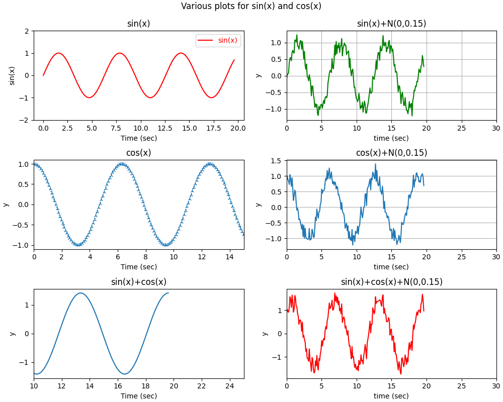
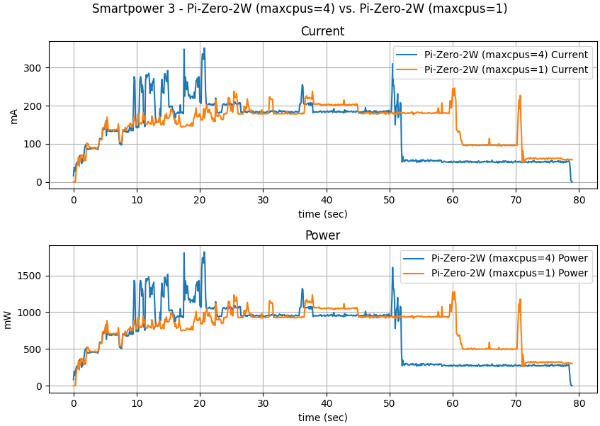

Sample Configuration Files
==========================

Files in this directory are sample configuration files. They demonstrate
various aspects of the configuration system and are meant to be used
as blueprints for your own configurations.

All examples assume that the first column (number zero) is the column
with the timestamps.

All "sincosXXX"-examples operate on test-data you can create with
the script `tools/sincos-data.py`. See the toplevel readme for details.

default.json
------------

A very minimal example. It plots the first two columns of the data.

sincos1.json
------------

A single plot with two values (x-axis formatted as time).

sincos2.json
------------

A plot with two subplots, each plot with a single value. This
configuration also changes the color of the lines.

sincos6x1.json
--------------

A plot with the default layout: one column and as many rows as necessary.

sincos1x1x6.json
----------------

All data-values in a single plot. The legend is moved to the left of
the plot.

sincos3x2x1.json
----------------

A plot with three rows and two columns. Each subplot plots a single
value.

Configuration tweaks:

  - toplevel defaults for xaxis, yaxis, grid and legend
  - default is no legend and no grid
  - some subplots override these defaults
  - xaxis with default maximum of 30
  - min and max changed for various subplots
  - lines with markers and different linestyle

sp3-3x3x1.json
--------------

A configuration for [Hardkernel's "Smart-Power-3"-system](https://wiki.odroid.com/accessory/power_supply_battery/smartpower3).

This configuration will print 9 subplots in a 3x3 grid. The top row with
the input-sensor data, the middle row with channel-0 data and the bottom
row with channel-1 data. (Note that for the image the title and labels were
modified to reflect the specific application-example.)

sp3-2x1x2.json
--------------

Another configuration for the Smart-Power-3. This configuration will plot
the current and power data in a 2x1 grid. Each subplot plots the values
of both channels. (Note that for the image the title and labels were
modified to reflect the specific application-example.)

sp3-ch0.json
------------

This configuration (again for Smart-Power-3) will plot
voltage and current of channel 0 in a single plot with two axes.

bme280-3x1x1.json
-----------------

Configuration for the BME280 sensor with temperature, pressure and humidity.
